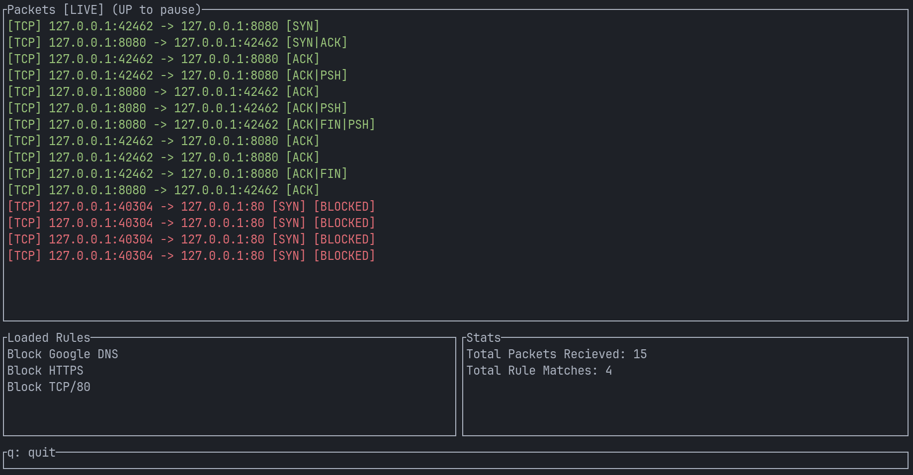

# rust-firewall

A packet filter and mini-firewall written in Rust, targeting Linux. Built as an excuse for a learning exercise for low-level systems and network programming in Rust.

## Features

- **Raw packet capture** - uses raw Linux sockets via `libc` (`AF_PACKET, SOCK_RAW`) directly, no pcap dependency. This is now legacy and the firewall uses a single nfqueue pipeline.
- **Manual header parsing** - Ethernet → IPv4 → TCP/UDP parsed by hand into Rust structs, including TCP flag inspection
- **NFQUEUE packet interception** - integrates with Linux Netfilter via `libnetfilter_queue` to intercept packets and issue `NF_ACCEPT` or `NF_DROP` verdicts. Actually blocks traffic.
- **Rule engine** - JSON-based rules supporting filtering by source IP, destination IP, destination port, and protocol
- **Persistent rules** - rules are saved back to disk on modification
- **Runtime CLI** - TCP server on port 7878 accepting live commands while capture runs
- **Live TUI** - `ratatui`-based terminal interface with live packet log, stats, rule list, scrolling and pause/resume

