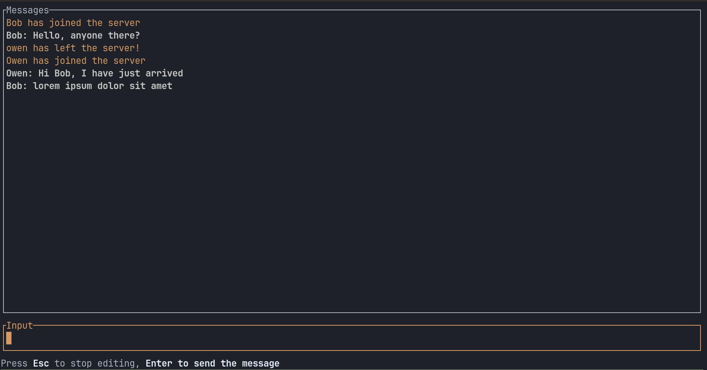

# Signed TCP Chat Room

## Features

- Multi-client TCP chat server with concurrent connection handling
- HMAC-SHA256 message signing: tampered or unsigned messages are rejected
- JSON message protocol over raw TCP
- Terminal UI built with ratatui: modal input, colour-coded messages
- Join/leave notifications

